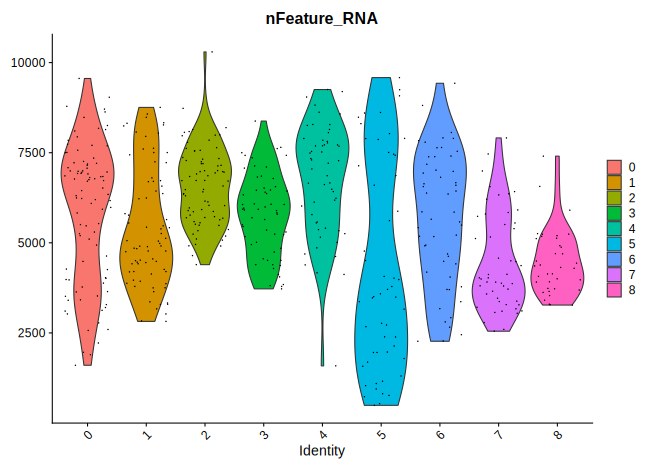
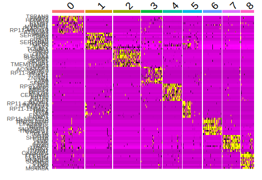
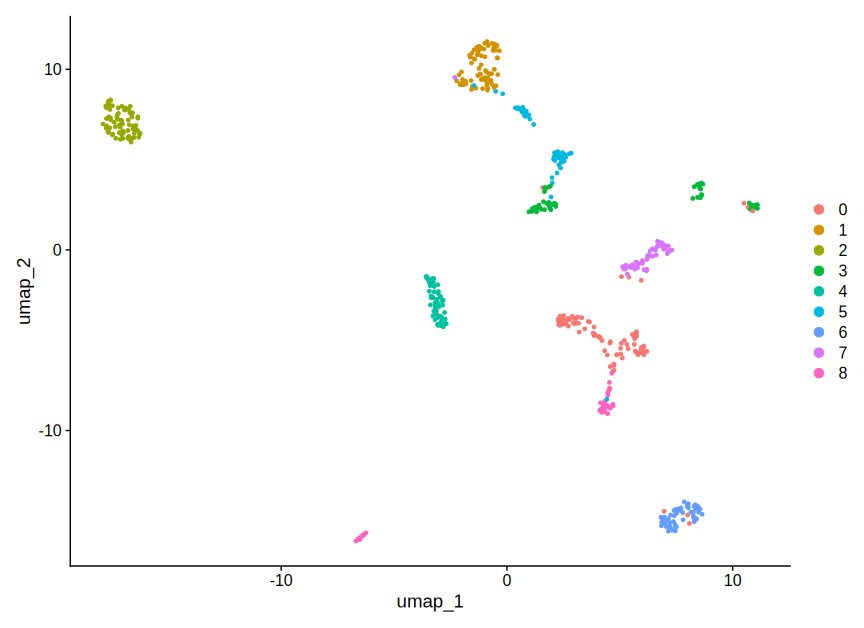
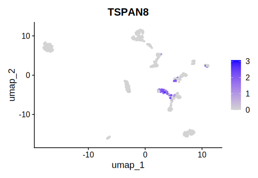
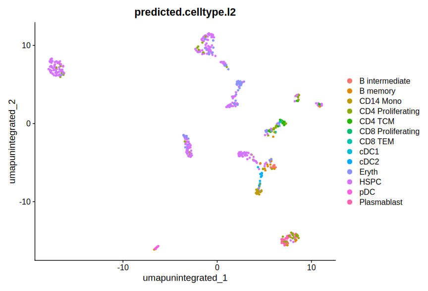
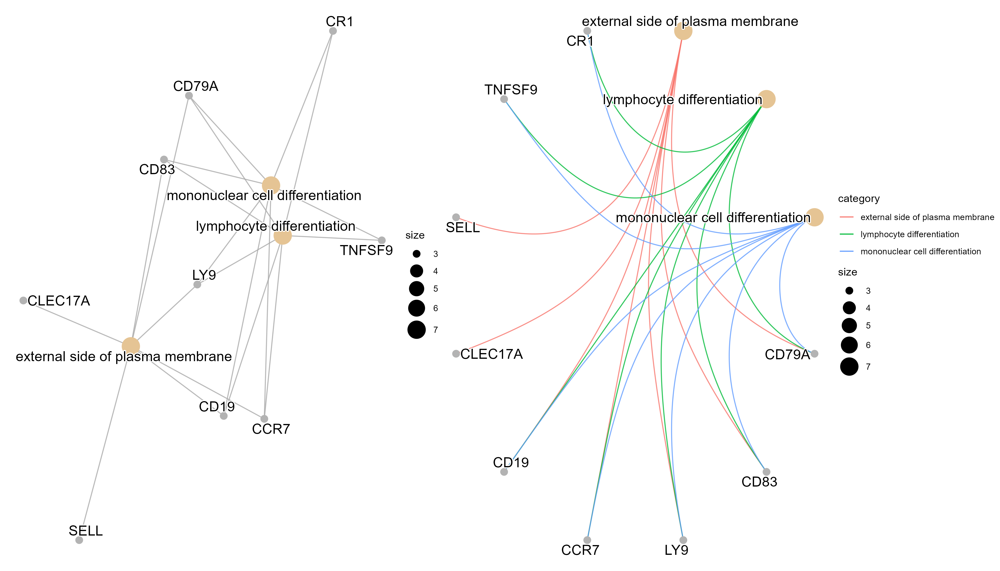
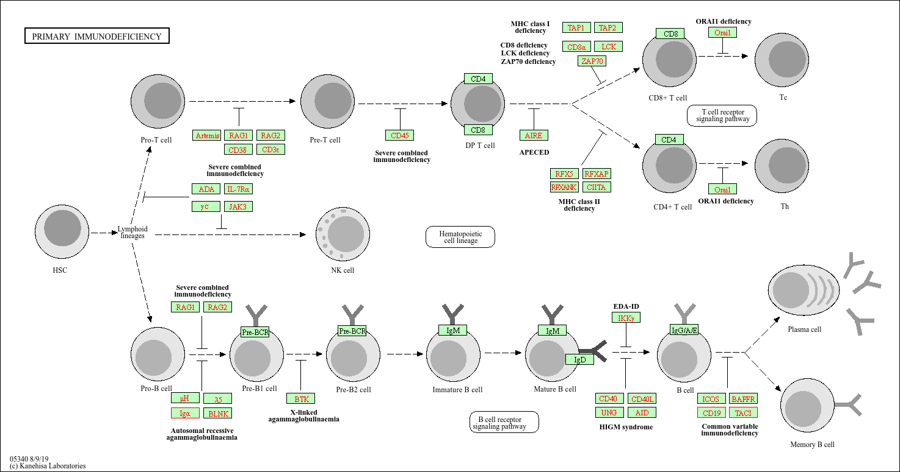

# Samsung Genome sc-RNA seq Project

Hello, I'm Brian Bulag, a Senior year Biology-Philosophy double major at Stony Brook University.

This repository is a trial run of using Seurat from the Satija Lab guided vignettes with publicly available data from The Samsung Genome Institute. 

Special thanks to my friend and mentor, Kevin Chen, for guidance and producing most of the Part 2 script. 

The GEO link : 
https://www.ncbi.nlm.nih.gov/geo/query/acc.cgi?acc=GSE75688

corresponding publication : 
https://www.ncbi.nlm.nih.gov/pmc/articles/PMC5424158/

The Satija Lab Vignette :
https://satijalab.org/seurat/articles/pbmc3k_tutorial#standard-pre-processing-workflow


# Loading The Packages
```
library(dplyr)
library(Seurat)
library(patchwork)
library(httpgd)
library(SeuratData)
library(SeuratWrappers)
library(ggplot2)
library(patchwork)
```
# Data Wrangling 

```
gse756d <- read.delim("your/path/here.txt", header = TRUE, stringsAsFactors = FALSE)

## This was necessary since no mtx with it's associated tsv's were separated. Wrangling for the gene column was added with the cell counts to get our data frame, which was .txt in this case

View(gse756d) 
head(rownames(gse756d))

gse756genes <- gse756d[,2]


## Selecting to remove cols 1-18 [Data is stored differently across different sets, here, cols 1-18 were not relevant matrix data]
cellgse756_columns = gse756d[, 18:ncol(gse756d)]

# Set the row names of cellgse756_columns to be gse756genes
# Make duplicate gene names unique
gse756genes <- make.unique(gse756genes)

# Now try setting the row names again
rownames(cellgse756_columns) <- gse756genes

# Create a Seurat gse756d_seuratect
gse756d_seurat <- CreateSeuratObject(counts = cellgse756_columns)

##> dim(gse756d_seurat)
##[1] 57915   549
```

## Seurat Cluster Analysis Workflow 

```
VlnPlot(gse756d_seurat, features = "nFeature_RNA")

```



```
# Normalize Data
gse756d_seurat <- NormalizeData(gse756d_seurat, normalization.method = "LogNormalize", scale.factor = 10000)

# Variable Features
gse756d_seurat <- FindVariableFeatures(gse756d_seurat, selection.method = "vst", nfeatures = 500)
## Identify the 10 most highly variable genes
top10 <- head(VariableFeatures(gse756d_seurat), 10)

top10 

> top10
# A tibble: 90 × 7
      p_val avg_log2FC pct.1 pct.2 p_val_adj cluster gene
      <dbl>      <dbl> <dbl> <dbl>     <dbl> <fct>   <chr>
 1 8.70e-44       6.23 0.659 0.083  5.04e-39 0       TSPAN8
 2 2.51e-39       5.71 0.637 0.085  1.45e-34 0       FABP7
 3 1.50e-34       4.69 0.615 0.098  8.71e-30 0       HOXA10
 4 9.17e-34       6.10 0.352 0.009  5.31e-29 0       CHST9
 5 7.27e-33       5.22 0.593 0.098  4.21e-28 0       CLDN1
 6 1.09e-32       4.20 0.681 0.138  6.29e-28 0       BANK1       
 7 3.84e-32       4.79 0.462 0.041  2.23e-27 0       MYBPC1
 8 6.57e-32       2.39 0.396 0.022  3.81e-27 0       PLA2G2A
 9 1.60e-31       4.89 0.462 0.044  9.27e-27 0       RP11-48O20.4
10 9.76e-30       5.26 0.484 0.061  5.65e-25 0       ATP13A4
# ℹ 80 more rows
# ℹ Use `print(n = ...)` to see more rows


## plot variable features with and without labels
plot1 <- VariableFeaturePlot(gse756d_seurat)
plot2 <- LabelPoints(plot = plot1, points = top10, repel = TRUE)
plot1 + plot2

```


```
# Scale Data
all.genes <- rownames(gse756d_seurat)
gse756d_seurat <- ScaleData(gse756d_seurat, features = all.genes)

# PCA
gse756d_seurat <- RunPCA(gse756d_seurat, features = VariableFeatures(object = gse756d_seurat))

############
> gse756d_seurat <- RunPCA(gse756d_seurat, features =#) VariableFeatures(object $#)
PC_ 1 
Positive:  AIF1, TYROBP, FCER1G, C1QB, CD163, MS4A6A, MSR1, C1QA, LYZ, FCGR3A
           FCGR2A, RP11-1143G9.4, C1QC, ADAMDEC1, MS4A4A, CD14, APOC1, SERPING1, CCL8, IGSF6
           C3AR1, TGFBI, CCL4, LILRB4, CTSC, AXL, C1orf54, CCL2, CCL3, VSIG4
Negative:  MGP, CTTN, PIP, RPL23, CLU, COX6C, AGR2, THRSP, MTND2P28, SCGB2A2
           SULT1E1, SLC30A8, TFF1, MT1G, CLEC3A, TFF3, SCGB2A1, AGR3, MGLL, DCD
           TMEM45A, ZNF165, MUCL1, SCGB1D2, PSMB3, HMGCS2, SLPI, VSNL1, S100P, S100A7
PC_ 2
Positive:  RGS1, HLA-DRA, HLA-DPA1, CD74, CD83, HLA-DQB1, HLA-DPB1, CD52, CD69, LRMP
           MS4A1, IGKC, ALOX5AP, RGS2, RGS13, CD79B, TCL1A, RP1-257A7.5, IGJ, SNX29P2.1 
           AC096579.7, ZNF331, VPREB3, GPR183, HMGB2, GPR18, AICDA, IFI30, BCL2A1, PRPSAP2
Negative:  DCN, COL3A1, COL1A2, LUM, COL1A1, BICC1, VCAN, AEBP1, SPARC, FAP
           ASPN, SFRP4, CTHRC1, PDGFRL, CTSK, HTRA1, FSTL1, POSTN, CRISPLD2, BGN
           MMP2, SFRP2, NNMT, TAGLN, C1S, MFAP5, RARRES2, MFAP2, THY1, C1R
PC_ 3
Positive:  LRMP, MS4A1, RGS13, SNX29P2.1, TCL1A, CD83, IGKC, CD79B, CD69, RGS2
           GPR18, VPREB3, AICDA, IGJ, PRPSAP2, CD52, HMGB2, AC096579.7, RN7SL627P, RN7SL639P
           CCDC144B, RGS1, IGHG1, GCSAM, HLA-DOB, COL3A1, DCN, ELL3, COL1A2, RP1-257A7.5
Negative:  CTTN, CD163, MGP, MTND2P28, MSR1, FCGR3A, C1QB, C1QA, AGR2, ADAMDEC1
           COX6C, C1QC, PIP, FCGR2A, CCL8, CD14, CTSL, VSIG4, TFF3, LYZ
           C3AR1, CCL13, APOC1, RP11-1143G9.4, MS4A4A, CLU, THRSP, SCGB2A2, RNASE1, S100P
PC_ 4
Positive:  CD3G, CD3D, NKG7, TRBC2, GZMA, CTSW, KLRK1, IFNG, IL32, CD96
           CCL5, GNLY, GZMB, GZMH, OASL, ITM2A, CD8A, KLRD1, GIMAP7, CST7
           AC092580.4, TRGC2, CXCL13, GBP5, TRDC, IFITM1, IFI44L, LCK, TRGV10, ISG15
Negative:  RGS13, PRPSAP2, SNX29P2.1, ELL3, MS4A1, RP1-257A7.5, CCDC144B, RN7SL639P, RN7SL627P, AICDA 
           VPREB3, GPR18, LRMP, CD79B, STAG3, IFI30, TCL1A, CD83, HLA-DQB1, IGHG1
           GCSAM, MS4A7, SEC14L1, IGKC, C1QB, MS4A4A, CD163, APOC1, C1QA, FCGR2A
PC_ 5
Positive:  PIP, SLC30A8, RPL23, SULT1E1, TMEM45A, PSMB3, THRSP, DCD, CLEC3A, VSNL1
           MGP, TAT, SERPINF1, CD36, S100A7, SCGB2A2, IL3RA, SCGB2A1, LILRA4, CLEC4C
           PLAC8, GZMB, AEBP1, SFRP4, ASPN, COL3A1, COL1A1, HMGCS2, RP11-117D22.2, POSTN
Negative:  SAA1, MMP7, MIA, AC005152.3, SAA2, LTF, KRT14, AP000688.8, A2M, GABRP
           PAM, WARS, GBP1, ANXA1, UBD, RP11-635N19.3, KRT17, S100P, SLPI, VGLL1
           PDZK1IP1, CXCL1, CTGF, C1S, IFITM3, KLK8, IDO1, LBP, KRT81, MYLK
###############


# Heat Map
DimHeatmap(gse756d_seurat, dims = 1:15, cells = 500, balanced = TRUE)

# Find Clusters
gse756d_seurat <- FindNeighbors(gse756d_seurat, dims = 1:10)
gse756d_seurat <- FindClusters(gse756d_seurat, resolution = 0.5)

# UMAP
gse756d_seurat <- RunUMAP(gse756d_seurat, dims = 1:10)
DimPlot(gse756d_seurat, reduction = "umap")

# Find marker genes
gse756d_seurat.markers <- FindAllMarkers(gse756d_seurat, only.pos = TRUE)
gse756d_seurat.markers %>%
  group_by(cluster) %>%
  dplyr::filter(avg_log2FC > 1)

## ENSEMBL
FeaturePlot(gse756d_seurat,features='ENSG00000127324.4') 

## Gene symbol
FeaturePlot(gse756d_seurat,features="TSPAN8")


## The last part of the vignette, cell type labelling, I did via integration with Azimuth 

library(Matrix)
library(Azimuth)

gse756d_seuratint <- gse756d_seurat

gse756d_seuratint <- RunAzimuth(gse756d_seuratint, reference = "pbmcref")
gse756d_seuratint <- RunUMAP(gse756d_seuratint, dims = 1:10, reduction = "pca", reduction.name = "umap.unintegrated")

DimPlot(gse756d_seuratint, reduction = "umap.unintegrated", group.by = c("Method", "predicted.celltype.l2"))
```



Here is the unlabbeled UMAP, with selection TSPAN8





And here is a rough annotation using Azimuth



## Part 2: GSEA [In Progress]

```
## Data Wrangling

a <- read.table('your/path/here.txt', header=T)

pseudo_bulk <- a[, 4:17]

pseudo_bulk <- cbind(gene_names,pseudo_bulk)

gene_names <- a[,1]

# Remove decimals from ENSEMBL ID
gene_names <- gsub("\\..*", "", gene_names)

gex2 <- pseudo_bulk[,2:15]

# Create LN meta data (0 for no LN, 1, for LN)
LN_meta.data <- as.data.frame(c(0,0,0,0,1,0,0,0,0,1,0,0,0,0))
```

Here is the linear regression - the data was wrangled so that the Lymph Node Metastasis group [denoted LN, as the experimental group] were assigned a binary 1, with the other data columns being assigned 0, as a control group. The results of the regression were used for KEGG/GO analysis.

```
n <- length(gene_names)
result.i <- NULL
result <- NULL
for (i in 1:n){
  # For each gene in the data set, find if that gene is significantly different between 2 groups (control vs LN)
  gene <- gene_names[i]
  # Grab the expression values for the gene expression (gex) of gene "i"
  beta <- gex2[i,]
  # Create a data frame to input into the linear regression model (lm=linear model, df = dataframe)
  ## Rows are individuals, column 1 = gene expression, column 2 = binary LN
  lm_df <- cbind(t(beta),LN_meta.data)
  colnames(lm_df) <- c(gene,'LN_binary')
  fix.eff <- paste0(gene,' ~ LN_binary')
  fix.eff <- formula(fix.eff)
  #fit=glm(fix.eff,data=lm_df,family=binomial(link=logit))
  fit <- glm(fix.eff,data=lm_df)
  exposure <- 'LN_binary'
  result.anno <- gene # Specify column name for statistic summary table
  if (!inherits(fit, "try-error")) {
    BETA <- formatC(summary(fit)$coefficients[exposure,1],format="e",digits=2)
    STDERR <- formatC(summary(fit)$coefficients[exposure,2],format="e",digits=2)
    t <- formatC(summary(fit)$coefficients[exposure,3],format="e",digits=2)
    P <- formatC(summary(fit)$coefficients[exposure,4],format="e",digits=2)
    result.i <- cbind.data.frame(result.anno,exposure,BETA,STDERR,t,P)
    result <- as.data.frame(rbind(result,result.i))
  } else{
    BETA <- "NA"
    STDERR <- "NA"
    t <- "NA"
    P <- "NA"
    result.i <- cbind.data.frame(result.anno,exposure,BETA,STDERR,t,P)
    result <- as.data.frame(rbind(result,result.i))
  }
}

result$BETA <- as.numeric(result$BETA)
result$STDERR <- as.numeric(result$STDERR)
result$t <- as.numeric(result$t)
result$P <- as.numeric(result$P)


tibble(result$P)
# If you get an ERCC error, you can ignore it, the sumamry statistics data frame still comes out just fine

# Set P-value threshold to account for multiple testing
bonferroni_threshold <- 0.05/n
top_genes <- filter(result, P<bonferroni_threshold)
write.table(top_genes,'top_genes_summary_statistics2.txt')
```
Here, the result was 85 significantly different genes, which would result in 5 GO pathways. My script at this point was only producing 3, which is either likely due to either ENSEMBL -> ENTREZID/gene symbol failing, or perhaps due to the earlier integration.


```
##### Gene Pathway Analysis #####
library(org.Hs.eg.db)
library(ggplot2)
library(clusterProfiler)

# Load in human gene set
hs <- org.Hs.eg.db
# Get a list of top genes
top_genes_ls <- top_genes$result.anno


## Heres our 85 significant genes
########
> tibble(top_genes_ls)
# A tibble: 85 × 1
   top_genes_ls
   <chr>
 1 ENSG00000038532
 2 ENSG00000048471
 3 ENSG00000081019
 4 ENSG00000083844
 5 ENSG00000095794
 6 ENSG00000101265
 7 ENSG00000105369
 8 ENSG00000111886
 9 ENSG00000112137
10 ENSG00000112149
# ℹ 75 more rows
# ℹ Use `print(n = ...)` to see more rows
########


# Annotate genes from ENSEMBL into entrezID and gene symbol
ensembl_entrez_mapping <- AnnotationDbi::select(hs,
                                                keys = top_genes_ls,
                                                keytype = "ENSEMBL",
                                                columns = c("ENTREZID", "SYMBOL"))


Here, gene 29 had two outputs, resulting in an extra row entry, as
there were two genes with two ENTREZID that mapped onto it. About 27%~ failed to map, which might have caused the 2 missing pathways.
########
> tibble(ensembl_entrez_mapping) 
# A tibble: 86 × 3
   ENSEMBL         ENTREZID SYMBOL
   <chr>           <chr>    <chr>
 1 ENSG00000038532 23274    CLEC16A
 2 ENSG00000048471 92017    SNX29
 3 ENSG00000081019 54665    RSBN1
 4 ENSG00000083844 9422     ZNF264 
 5 ENSG00000095794 1390     CREM
 6 ENSG00000101265 9770     RASSF2
 7 ENSG00000105369 973      CD79A
 8 ENSG00000111886 2570     GABRR2
 9 ENSG00000112137 221692   PHACTR1
10 ENSG00000112149 9308     CD83
# ℹ 76 more rows
# ℹ Use `print(n = ...)` to see more rows
########


# Perform GO gene enrichment
ggo=enrichGO(gene=ensembl_entrez_mapping$ENTREZID,
             OrgDb=org.Hs.eg.db,
             ont='ALL',
             pAdjustMethod='fdr',
             pool=T,
             readable=T)
head(ggo)


########
> head(ggo)
           ONTOLOGY         ID                      Description GeneRatio
GO:0009897       CC GO:0009897 external side of plasma membrane      7/49
GO:0030098       BP GO:0030098       lymphocyte differentiation      7/49
GO:1903131       BP GO:1903131 mononuclear cell differentiation      7/49
             BgRatio       pvalue   p.adjust     qvalue
GO:0009897 387/20757 3.245540e-05 0.02989460 0.02451881
GO:0030098 429/20757 6.228041e-05 0.02989460 0.02451881
GO:1903131 481/20757 1.271280e-04 0.04068096 0.03336553
                                          geneID Count
GO:0009897 CD79A/CD83/LY9/CCR7/CD19/CLEC17A/SELL     7
GO:0030098   CD79A/CD83/LY9/TNFSF9/CCR7/CD19/CR1     7
GO:1903131   CD79A/CD83/LY9/TNFSF9/CCR7/CD19/CR1     7
########


# Create cnet plot (gene concept network plot)
edox=setReadable(ggo,'org.Hs.eg.db','ENTREZ')
p1=cnetplot(edox)
p2=cnetplot(edox,circular=T,colorEdge=T)
#cowplot::plot_grid(p1,p2,ncol2=2,labels=LETTERS[1:3],rel_width=c(.8,.8,1.2))
p3=p1+p2
ggsave('cnet.png',p3,height=8,width=14)


# Perform KEGG gene enrichment
kk=enrichKEGG(gene = ensembl_entrez_mapping$ENTREZID,
              organism = 'hsa',
              pvalueCutoff = 0.05)
# Extract KEGG pathway IDs
pathway_ids <- kk$ID
browseKEGG(kk,pathway_ids[1]) # Since KEGG only identified 1 cellular pathway, you can just set the index to 1

```
Here is the CNET 


Here is the KEGG 



Upnext
[1] A GO cnet plot with a log2fc comparing gene expression between the LN/non-LN
[2] Improving ENSEMBL <-> ENTREZID mapping
[3] DeSeq and more indepth GSEA